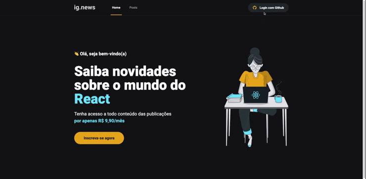

<p align="center">
  
</p>

<h3 align="center">  
  <p align="center">
    <a href="#-sobre">Sobre</a>&nbsp;&nbsp;&nbsp;|&nbsp;&nbsp;&nbsp;
    <a href="#-tecnologias">Tecnologias</a>&nbsp;&nbsp;&nbsp;|&nbsp;&nbsp;&nbsp;
    <a href="#-tecnologias">Layout</a>&nbsp;&nbsp;&nbsp;|&nbsp;&nbsp;&nbsp;
    <a href="#-como-executar">Como Executar</a>&nbsp;&nbsp;&nbsp;|&nbsp;&nbsp;&nbsp;
    <a href="#-licença">Licença</a>
  </p>
</h3>

<div align="center">
     
</div>

## 📚 Sobre

O projeto consiste em uma **plataforma de notícias** com postagens relacionadas a tecnologia ReactJS.

Em forma de listagens, a plataforma possui também um sistema de inscrição em que o conteúdo varia de acordo com a assinatura do usuário.

## 🚀 Tecnologias utilizadas:

- [ReactJS](https://legacy.reactjs.org/)
- [Next.js](https://nextjs.org/)
- [TypeScript](https://www.typescriptlang.org/)
- [Sass](https://sass-lang.com/)
- [Stripe](https://www.npmjs.com/package/@stripe/react-stripe-js)
- [FaunaDB](https://docs.fauna.com/fauna/current/)
- [Prismic](https://prismic.io/)
  

## ⏱️ Como executar

```bash
# Clonar o repositório
$ git clone https://github.com/polyanetuag/ignews.git

# Entrar na pasta  
$ cd ignews

# Instalar as dependências
$ yarn 

# Iniciar o servidor
$ yarn dev
```

Depois, abra http://localhost:3000 com seu navegador para ver o resultado.

## 📝 Licença

Esse projeto está sob a licença MIT.

---
Desenvolvido com 💜 por Polyane Tuag
